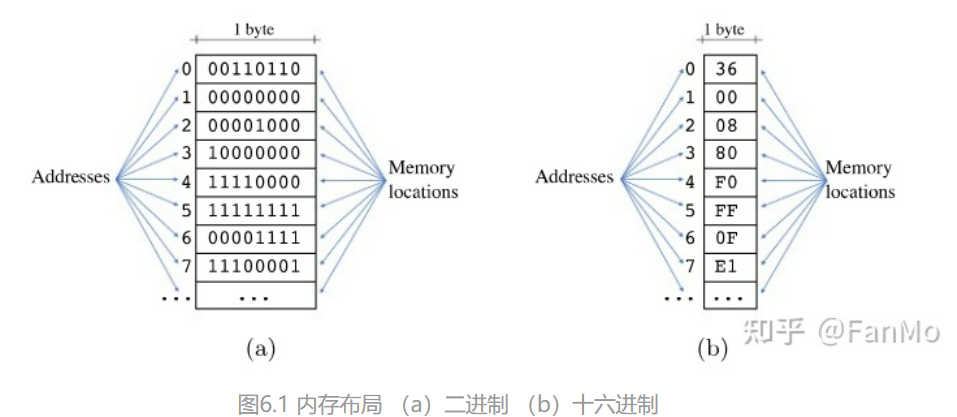

# Assembly_Study

## 编译参数

```shell
clang -S a.c --target=riscv32 -march=rv32im //由a.c生成riscv32的汇编代码a.s

clang -S a.ll --target=riscv32 -march=rv32im //由a.ll生成riscv32的汇编代码a.s
```


首先，一张图说明不同语言之间的关系，越往上的语言越高级，越往下越底层。


我们大作业要做的就是把 `Mx*` 语言翻译成 `Assembly Langue` 。 

我们已经知道，CPU 的原理其实非常简单，它只是一条一条地执行我们输入的指令。

这些指令都是 32 或 64 位的 **二进制** ， 称为 **操作码（opcode）**。但是这些二进制 instruction 我们人类是无法阅读的， 而 `Assembly` 本质上是做了一个翻译的操作，把不可读的二进制操作码转成人类可识读的代码。也就是说：**汇编语言(Assembly) 是二进制指令的文本形式**。

## 汇编语言的来历

伟大思想课上，我们了解过，最早的二进制指令是通过纸带传入 CPU 的，但由于为了更好的可读性，工程师发明了汇编语言，这样就多出一步将汇编指令翻译为二进制指令。这个步骤称为 `assembling` ，完成这个步骤的程序叫做 `assembler` . 它处理的文本叫做 `assembly code` 标准化后称为 `assembly language` ， 缩写为 `asm` ，中文译作 “汇编”。不同机器上的汇编是不同的。常见的有 x86， riscv...

本次大作业我们的目标汇编代码是 ：RISC-V **32bit, Integer Extended**

## RV32IM

M表示：该指令包含整数乘除法指令。

该指令集主要有以下特点：

- 支持32位地址空间
- 有33个32位寄存器
- 补码有符号数
- 包含基本指令、整数乘除法指令、整数加载指令、整数存储指令、控制指令

### 1.RV32I 数据类型和内存组织

RV32I 原始数据类型：

|       类型        | 字节数 |
| :---------------: | :----: |
|       byte        |   1    |
|   unsigned byte   |   1    |
|     halfword      |   2    |
| unsigned halfword |   2    |
|       word        |   4    |
|   unsigned word   |   4    |

在汇编语言中，就只有这么几种类型。

每个单字节都有唯一的32位地址：



### 2.RV32I 寄存器


### 3.load & store

load 和 store 的格式都是 寄存器加立即数的形式写的：

```assembly
lw a5 0(a0)
add a6 a5 a5
sw a6 0(a0)
```

### 4.伪指令

伪指令是一种没有直接对应机器码的汇编指令，但是他们可以被翻译成一组同等效果的机器指令。例如：`nop` 指令可以被等价地翻译成 `add x0, x0, 0` 。

### 5.logic & arith 指令

#### 5.1 指令语法

这些指令都有相同的格式，包含三个操作数：一个目标操作数（rd）， 两个源操作数（rs1，rs2）。rs2有可能是寄存器或立即数。

通用寄存器 x0-x31都有可能被用成三个操作数，当x0被用作目标寄存器时，结果会被抛弃。

#### 5.2 处理较大的立即数

立即数会被直接编码到机器指令中，而立即数最多能编码12位，其范围是 `-2048~2047` 之间。可以通过几条指令复合来获取较大的立即数：

```assembly
add a5, x0, 1000
slli, a5, a5, 2
add a5, a5, 5
```

这样我们获得了立即数 4005， 存在a5寄存器中。

实际上，RISCV 有伪指令 `load immeadiate` ， 格式为 `li rd imm` 汇编器会按照最佳指令顺序翻译为机器码。

#### 5.3 逻辑运算指令


#### 5.4 位移指令


注意区分逻辑位移和算数位移：

逻辑位移是移动所有二进制bit位，算数位移是除符号位之外的bit位位移。

#### 5.5 算数指令

带M后缀的指令集增加了 `mul,div, rem` 三个指令。


其实本质上M拓展只是各种位移操作和加减法运算实现的。

### 6. 数据移动指令


#### 6.1 加载指令

小端load：


无符号加载高位置0，有符号加载时，高位进行符号位拓展，即：如果是正数，高位全部置为0；如果为负数，高位全部置为1。

#### 6.2 存储指令

和加载指令一样同样遵循小端store指令。从低位进行store，可以看做是load的逆向过程。

#### 6.3 数据移动指令

mv, li, la指令，这里不再赘述。

### 7. 控制流指令

#### 7.1 条件跳转指令


#### 7.2 无条件跳转指令


其中，`j,jr,ret` 指令都是伪指令，`j lab`  =  `jal zero, lab` ; `jr rs1` = `jarl zero, rs1, 0` ; `ret` = `jal zero ra, 0`. 其中zero是寄存器x0.

### 8. 条件置位指令

将判断结果存入rd中，有以下几种：


## 地址空间

每个程序的空间可以被划分为四部分。

1. 一个静态确定的代码区 $Code$ 。这个区域存放可执行的目标代码。
2. 一个静态确定的静态数据区 $Static$ 。存放全局常量和编译器生成的其他数据。
3. 一个动态管理的堆区 $Heap$ 。存放运行过程中分配和释放的数据对象。new 出来的东西。
4. 一个动态管理的栈区 $Stack$ 。存放活动记录，主要是一些函数调用，函数返回等。


## Some

1. p2align 参数用作内存对其。