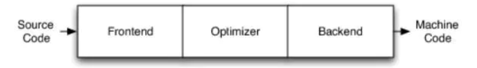
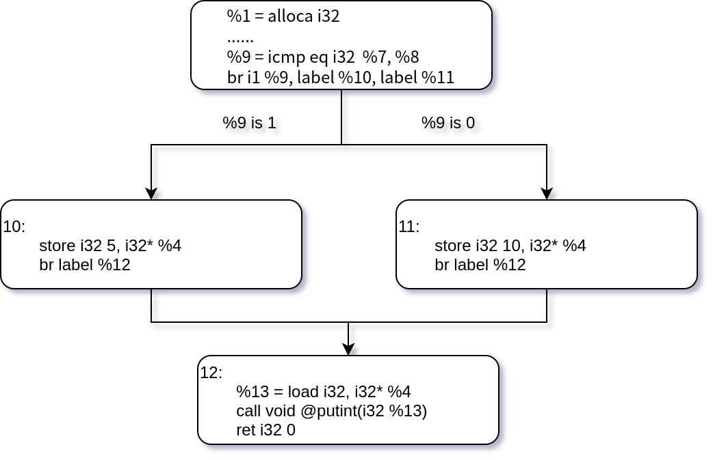
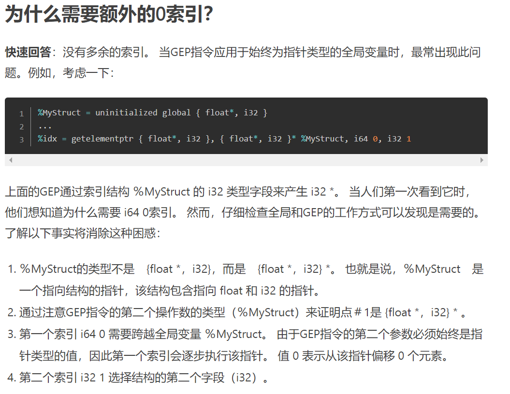

# LLVM_Study

## What is LLVM?

LLVM项目是模块化、可重用的编译器以及工具链技术的集合。

是构建编译器的一个框架。

## 优点？

### 传统编译器架构：



- Frontend: lexer，parser，semantic，生成IR
- Optimize:优化IR
- Backend:生成机器码

### LLMV架构


不同的前后端使用同一中间语言IR

前端：将源代码翻译为 IR

中端：对IR进行优化

后端：将IR翻译为目标语言

## LLVM IR

使用命令

```shell
clang -S -emit-llvm foo.c
```

可将 foo.c 编译为 foo.ll 文件，打开就能看到 llvm IR 语言。

```c++
int main(){
    return 0;
}
```

编译为 ir 后为：

```assembly
; main.ll
target datalayout = "e-m:o-i64:64-f80:128-n8:16:32:64-S128"
target triple = "x86_64-apple-macosx10.15.0"

define i32 @main() {
    ret i32 0
}
```

##### 注释

以 ; 开头的一行为注释，没有多行注释。

##### 目标数据分布和平台

第二行的 `target datalayout` 和 `target triple` 表示目标汇编代码的数据分布和平台。

例如：在本地跑出来的结果：

```assembly
target datalayout = "e-m:w-p270:32:32-p271:32:32-p272:64:64-i64:64-f80:128-n8:16:32:64-S128"
target triple = "x86_64-w64-windows-gnu"
```

更详细地解释：

```c
// main.c
int foo(int first, int second) {
    return first + second;
}

int a = 5;

int main() {
    int b = 4;
    return foo(a, b);
}
```

编译出来的 LLVM IR 为下：

```assembly
; ModuleID = 'main.c'
source_filename = "main.c"
target datalayout = "e-m:e-p270:32:32-p271:32:32-p272:64:64-i64:64-f80:128-n8:16:32:64-S128"
target triple = "x86_64-pc-linux-gnu"

@a = dso_local global i32 5, align 4

; Function Attrs: noinline nounwind optnone sspstrong uwtable
define dso_local i32 @foo(i32 %0, i32 %1) #0 {
  %3 = alloca i32, align 4
  %4 = alloca i32, align 4
  store i32 %0, i32* %3, align 4
  store i32 %1, i32* %4, align 4
  %5 = load i32, i32* %3, align 4
  %6 = load i32, i32* %4, align 4
  %7 = add nsw i32 %5, %6
  ret i32 %7
}

; Function Attrs: noinline nounwind optnone sspstrong uwtable
define dso_local i32 @main() #0 {
  %1 = alloca i32, align 4
  %2 = alloca i32, align 4
  store i32 0, i32* %1, align 4
  store i32 4, i32* %2, align 4
  %3 = load i32, i32* @a, align 4
  %4 = load i32, i32* %2, align 4
  %5 = call i32 @foo(i32 %3, i32 %4)
  ret i32 %5
}

attributes #0 = { noinline nounwind optnone sspstrong uwtable "disable-tail-calls"="false" "frame-pointer"="all" "less-precise-fpmad"="false" "min-legal-vector-width"="0" "no-infs-fp-math"="false" "no-jump-tables"="false" "no-nans-fp-math"="false" "no-signed-zeros-fp-math"="false" "no-trapping-math"="true" "stack-protector-buffer-size"="8" "target-cpu"="x86-64" "target-features"="+cx8,+fxsr,+mmx,+sse,+sse2,+x87" "tune-cpu"="generic" "unsafe-fp-math"="false" "use-soft-float"="false" }

!llvm.module.flags = !{!0, !1, !2}
!llvm.ident = !{!3}

!0 = !{i32 1, !"wchar_size", i32 4}
!1 = !{i32 7, !"PIC Level", i32 2}
!2 = !{i32 7, !"PIE Level", i32 2}
!3 = !{!"clang version 12.0.1"}
```

`align` 描述程序的对齐属性；`dso_local` 是变量和函数的的运行时抢占说明符；

删掉这两项之后依然符合规范：

```assembly
; 所有的全局变量都以 @ 为前缀，后面的 global 关键字表明了它是一个全局变量
@a = global i32 5 ; 注意，@a 的类型是 i32* ，后面会详细说明

; 函数定义以 `define` 开头，i32 标明了函数的返回类型，其中 `foo`是函数的名字，`@` 是其前缀
; 函数参数 (i32 %0, i32 %1) 分别标明了其第一、第二个参数的类型以及他们的名字
define i32 @foo(i32 %0, i32 %1)  { ; 第一个参数的名字是 %0，类型是 i32；第二个参数的名字是 %1，类型是 i32。
  ; 以 % 开头的符号表示虚拟寄存器，你可以把它当作一个临时变量（与全局变量相区分），或称之为临时寄存器
  %3 = alloca i32 ; 为 %3 分配空间，其大小与一个 i32 类型的大小相同。%3 类型即为 i32*
  %4 = alloca i32 ; 同理，%4 类型为 i32*

  store i32 %0, i32* %3 ; 将 %0（i32）存入 %3（i32*）
  store i32 %1, i32* %4 ; 将 %1（i32）存入 %4（i32*）

  %5 = load i32, i32* %3 ; 从 %3（i32*）中 load 出一个值（类型为 i32），这个值的名字为 %5
  %6 = load i32, i32* %4 ; 同理，从 %4（i32*） 中 load 出一个值给 %6（i32）

  %7 = add nsw i32 %5, %6 ; 将 %5（i32） 与 %6（i32）相加，其和的名字为 %7。nsw 是 "No Signed Wrap" 的缩写，表示无符号值运算

  ret i32 %7 ; 返回 %7（i32）
}

define i32 @main() {
  ; 注意，下面出现的 %1，%2……与上面的无关，即每个函数的临时寄存器是独立的
  %1 = alloca i32
  %2 = alloca i32

  store i32 0, i32* %1
  store i32 4, i32* %2

  %3 = load i32, i32* @a
  %4 = load i32, i32* %2

  ; 调用函数 @foo ，i32 表示函数的返回值类型
  ; 第一个参数是 %3（i32），第二个参数是 %4（i32），给函数的返回值命名为 %5
  %5 = call i32 @foo(i32 %3, i32 %4)

  ret i32 %5
}
```

一些特性：

- LLVM IR是静态类型的（即在编写时每个值都有明确的类型）
- 局部变量的作用域是单个函数（比如 `@main` 中的 `%1` 是一个 `i32*` 类型的地址，而 `@foo` 中的 `%1` 是一个 `i32` 类型的值）
- 全局变量与局部变量由前缀区分，全局变量和函数名以 `@` 为前缀，局部变量以 `%` 为前缀

### LLVM IR 的结构

#### 总体结构

1. LLVM IR 文件的基本单位称为 `module` 。一个 `module` 为一个文件，但是本次大作业只需要单文件编译，不涉及到多文件编译。
2. 一个 `module` 中可以拥有多个顶层实体，比如 `function` 和 `global variavle` 。
3. 一个  `function define` 中至少有一个 `basicblock` 。
4. 每个 `basicblock` 中有若干 `instruction`，并且都以 `terminator instruction` 结尾。

### 数据表示

#### 汇编层次的数据表示

因为 llvm ir 最接近汇编代码，所以要先明确汇编层次的数据表示：

```c
#include <stdlib.h>

int global_data = 0;

int main() {
    int stack_data = 0;
    int *heap_pointer = (int *)malloc(16 * sizeof(int));
    return 0;
}
```

以上代码 C 语言的编译和过程 ：“代码 ---> 硬盘中的二进制程序 ---> 内存中的进程” 在代码被编译到二进制程序的时候， `global_data` 就已经被写在了二进制程序中。在操作系统将二进制程序载入内存时，就会在特定的区域**（数据区）**初始化这些值。而 `stack_data` 代表的局部变量，则是在程序执行其所在的函数时，在栈上初始化。`heap_pointer` 指针也是在栈中，其指向的内容由操作系统分配在对空间上。


所以说一共有三种类型：

- 数据区的数据
- 栈中的数据
- 堆中的数据

但是堆中的数据必须有一个指针作为接口，而指针是栈、堆、数据区的数据。而堆中的数据又会被其他指针引用（多级指针）。

所以加上寄存器一共有三种数据类型：

- 栈上的数据
- 数据区里的数据
- 寄存器中的数据

#### LLVM IR 中的数据表示

也是同汇编语言，是那三种数据类型。

##### 数据区的数据

也就是全局常量或变量

```assembly
@global_variable = global i32 0
;定义了一个 i32 类型的全局变量 @global_variable 并初始化为 0
```

```assembly
@global_constant = constant i32 0
;定义了一个 i32 类型的全局常量 @global_constant 并初始化为 0    
```

##### 寄存器和栈上的数据

LLVM IR 引入了虚拟寄存器的概念，寄存器以 % 开头升序排序。在用户层面，我们认为 LLVM IR 中的寄存器数量无穷多。

##### 全局变量和栈中变量均为指针

LLVM IR 中对全局变量以及对栈中的局部变量的操作都是特定类型的指针。

### 函数定义(Function Definition)

基本结构：

```assembly
define [return_type] @[function_name]([parameter_list]){
	[function_body]
}
```

### 基本块(Basic Block)

一个基本块是包含了若干个指令以及一个终结指令的代码序列。

基本块有以下几个属性：

- 基本块只会从终结指令退出
- 基本块的执行是原子性的，也就是说只要基本块中的某条指令执行了那么该基本块中的其他指令也会执行。
- 基本块内部没有控制流，控制流是由多个基本块直接通过跳转指令实现的。

也就是说，基本块内的代码是顺序执行的，而且顺序执行的一段代码属于一个基本块。

### 指令(Instruction)

这里的指令指的是非分支指令（non-branching Instruction），这些指令不会改变程序的控制流，使得程序顺序执行。

这里注意 call （函数调用指令）也是非分支指令，因为在当前基本块中我们只关心调用的函数的返回值是什么，而不必关心调用的函数的函数体内的语句是怎样的。

### 终结指令(Termination Instruction)

终结指令**一定**位于某个基本块的末尾（否则中间就改变了基本块内的控制流）。

反过来，每个基本块的末尾也**一定**是一条终结指令（否则仍然是顺序执行的，基本块不应该结束）。

使用一个例子来说明：

```c++
//if.c
int main() {
    int a = getint();
    int b = getint();
    int c = 0;
    if (a == b) {
        c = 5;
    } else {
        c = 10;
    }
    putint(c);
    return 0;
}
```

导出的 LLVM IR 代码如下：（已手动加上函数声明）

```assembly
declare i32 @getint()
declare void @putint(i32)
define  i32 @main() {
  %1 = alloca i32
  %2 = alloca i32
  %3 = alloca i32
  %4 = alloca i32
  store i32 0, i32* %1
  %5 = call i32 () @getint()
  store i32 %5, i32* %2
  %6 = call i32 () @getint()
  store i32 %6, i32* %3
  store i32 0, i32* %4
  %7 = load i32, i32* %2
  %8 = load i32, i32* %3
  %9 = icmp eq i32 %7, %8
  br i1 %9, label %10, label %11

10:                                               ; preds = %0
  store i32 5, i32* %4
  br label %12

11:                                               ; preds = %0
  store i32 10, i32* %4
  br label %12

12:                                               ; preds = %11, %10
  %13 = load i32, i32* %4
  call void @putint(i32 %13)
  ret i32 0
}
```

控制流程图如下：



```assembly
br i1 %9, label %10, label %11 ; A
br label %12 ; B
br label %12 ; C
```

`br` 指令两种用法：

1. `br + [tag] + truelabel + falselabel ` 如上述代码中的 A；

   如果tag为1bit的1则跳到truelabel否则跳到falselabel。一般会与icmp连着用

   ```assembly
   %5 = icmp eq i32 %4, 1
   br i1 %5, label %6, label %9
   ```

2.  `br + label` 如上述代码中的 B 和 C；

### 类型系统

类型系统可以帮助优化。

#### Void Type

仅站位用，不代表任何值和空间。

```assembly
define void @foo(){
  ret void
}
```

#### Integer Type

表示后面数字的位宽。

例如： `i1` 表示 `1bit` 的 integer 相当于 `bool` .

#### Label Type

用做代码标签，可用来实现控制流。官方文档的解释很简单，就一句表示代码的标签。

更合理的应该是表示 `basicblock` 进入的标签。

```assembly
 %cmp = icmp eq i32 %rem, 0	;icmp是比较指令，这里比较%rem与0是否相等
							;br指令是跳转指令，这里根据上一步比较出来的变量%cmp的值决定跳转到那个分支
							;label类型的作用就体现在这里
  br i1 %cmp, label %if.then, label %if.else
if.then:                                          ; preds = %entry
  store i32 0, i32* %retval, align 4
  br label %return
if.else:                                          ; preds = %entry
  store i32 1, i32* %retval, align 4
  br label %return

```

#### Array Type

由 数量 $\times$ 类型 组成。

```assembly
[40 x i32]	;由40个i32值组成的数组
[12 x [10 x float]]	;12x10 的二维数组，基础类型是float
[2 x [3 x [4 x i16]]]	;2x3x4 的三维数组，基础类型是i16
```

#### Pointer Type

指针类型用于指定内存位置，通常用于引用内存中的对象。指针类型可以有一个可选的地址空间属性，用于定义指向对象所在的编号地址空间。默认地址空间为0，非零地址空间的语义是特定于目标的。

**注意** ：没有指向void和label的指针。

### 一些常用的 Instructions and Terminator Instructions

#### 1.以加减乘除为代表的BinaryInst：

结构简单，由操作类型和左右操作数表示：

例如：

```assembly
add i32 %1, %2	;表示%1和%2相加
```

#### 2.br指令

上面在介绍LabelType时曾提到，这里不做解释。

#### 3.icmp指令

格式 `icmp + binaryInst` 

例如：

```assembly
icmp eq i32 %8, %9	;判断%8和%9是否相等
```

#### 4.store指令

[Writing into a memory location | LLVM Essentials (packtpub.com)](https://subscription.packtpub.com/book/application-development/9781785280801/3/ch03lvl1sec25/writing-into-a-memory-location)

一片介绍store指令的文章。

关于汇编层面new操作是怎样实现的

[汇编 rbp_new delete 以及 new[\] delete [] 汇编层面分析 - CodeAntenna](https://codeantenna.com/a/OjVzvqiZPI)

格式：`store <ty> <value>, <ty>* <pointer>`

后面是address前面是value。

#### 5.load指令

格式： `<result> = load <ty>, <ty>* <pointer>`

stackoverflow上的一个问题：[c - When does load, store, and alloca get used in LLVM - Stack Overflow](https://stackoverflow.com/questions/50537703/when-does-load-store-and-alloca-get-used-in-llvm)

#### 6.Alloc指令

格式： `<result> = alloca <type>`

alloc返回的是一个指针类型，指针指向的类型是 `<type>` .

Struct 和 string 类型的 `<type>` 是指针.

#### 7.GlobalDef指令

返回值是一个指针类型。其中baseType为传入的Type。

#### 8.Call指令

格式： `<result> = call [ret attrs] <ty> <fnptrval>(<function args>)` 

返回值为function的返回值

#### 9.BitCast指令

格式： `<result> = bitcast <ty> <value> to <ty2>             ; yields ty2`

读取value的内存方式以ty2的类型进行。

#### 10.Gep指令

[(17条消息) LLVM IR学习记录（1） GetElementPtr指令_许你一片梁城的博客-CSDN博客](https://blog.csdn.net/woiyyn/article/details/118670736)

格式：

```assembly
<result> = getelementptr <ty>, ptr <ptrval>{, [inrange] <ty> <idx>}*
<result> = getelementptr inbounds <ty>, ptr <ptrval>{, [inrange] <ty> <idx>}*
<result> = getelementptr <ty>, <N x ptr> <ptrval>, [inrange] <vector index type> <idx>
```

本次大作业只会用第二个。

计算目标元素的位置（仅计算）。获得复合数据结构的子元素的位置。

为什么需要额外的0索引：

[The Often Misunderstood GEP Instruction - 简书 (jianshu.com)](https://www.jianshu.com/p/71beb2916186)



#### 11.Trunc指令与Zext指令

这两个指令作用相反。

trunc指令用于把高位截断，然后低位转向其他类型

zext指令用于把高位填充0，然后转换为其他类型

格式：

```assembly
<result> = trunc <ty> <value> to <ty2>             ; yields ty2
<result> = zext <ty> <value> to <ty2>             ; yields ty2
```

例子：

```assembly
%X = trunc i32 257 to i8                        ; yields i8:1
%Y = trunc i32 123 to i1                        ; yields i1:true
%Z = trunc i32 122 to i1                        ; yields i1:false
%W = trunc <2 x i16> <i16 8, i16 7> to <2 x i8> ; yields <i8 8, i8 7>

%X = zext i32 257 to i64              ; yields i64:257
%Y = zext i1 true to i32              ; yields i32:1
%Z = zext <2 x i16> <i16 8, i16 7> to <2 x i32> ; yields <i32 8, i32 7>
```

## 为什么要用 LLVM IR

从 Mx 转到 LLVM IR 的操作使得原来复杂的 FrontEnd.Semantic.AST_Node 变为现在简单的树形结构，由于 `module` , `function` , `basicblock` 结构的限制，导致现在的 IRTree 最多只有三层高（其实看成 `basicblock` 构成的线性结构也是可以的）。因为从源代码到汇编的转化很难，所以需要中转一层，先转到 IR，一个弱线性结构的语言，再转到汇编就会简单很多，而且还便于优化。

## Builder实操

类似于ASTVisitor开一个hashmap记录类型node。从string对应到ir中的typenode。这样方便调用。

再开一个<String, IRFunction> <String, StringConst> 的hashtable。成员函数也是在

在visitRoot时把class，function都加进去，注意成员函数也要放到这个全局的map中。也就是说所有的函数都是在全局定义的。只不过成员函数加上了一些this关键字，表示它是一个成员函数。

alloc指令规范是要先做，但是也可以在任意位置做。

变量定义时，在计算初始值时，string和null比较特殊：null需要指明是指向哪种类型的null指针，而string需要使用Gep指令来获得字符串常量。Gep指令最后两位其中一位是指向第一个char，第二个可以理解为取地址。

声明变量时，如果变量是数组类型而且没有初始值的话，需要先将null赋给数组。


### 关于字符串和结构体的对象声明：

字符串是通过alloca一块char*类型的空间，所以返回值是char**

结构体是通过alloc一块classtype*类型的空间，所以返回值是classtype**

为字符串变量赋初值：拿到指向全局变量的stringconst的第一个char的指针，也就是说此时GepInst的返回值是char*类型，把这个GepInst赋给之前声明此字符串的地址即可。


llvm 是如何访问成员变量和数组的某位置的值的呢？

### 短路求值的做法：

只有当 && 或 || 操作符的左操作符不是Bool常量的时候才会进行短路求值。

具体做法：需要申请三个BasicBlock：short_block, long_block, terminal_block.

程序顺序执行到这个判断语句时，如果已经能够确定出这个表达式的值的时候（当 && 的左操作数的值为 false， || 的左操作符为 true ），跳转到 short_block，不再对右操作数进行操作，直接把整个表达式的值（此时就是左操作数的值） load 下来然后跳转到 terminal_block，否则跳转到 long_block，计算右操作数的值，然后把整个表达式的值 load 下来（此时为右操作数的值）；最后跳转到 terminal_block ，在 terminal_block 中会对整个表达式的值进行判断，看是否进入到if_then, (if_else) block中。

### 关于常量计算：

要注意 类似于 `string a = "hello " + "world";` 这样的语句不属于常量计算的范畴，因为两个字符串都是通过 GepInst 指令来实现的，也就是说在 LLVM IR 中两个字符串本身就是 指令类型而不是 IRConst 类型。

## Reference

[The LLVM Compiler Infrastructure Project](https://llvm.org/)

[用LLVM开发新语言 — LLVM教程 (llvm-tutorial-cn.readthedocs.io)](https://llvm-tutorial-cn.readthedocs.io/en/latest/index.html)

[实验简介 · GitBook (buaa-se-compiling.github.io)](https://buaa-se-compiling.github.io/miniSysY-tutorial/)

[LLVM IR入门指南 - 知乎 (zhihu.com)](https://www.zhihu.com/column/c_1267851596689457152)

[LLVM入门笔记 - 知乎 (zhihu.com)](https://www.zhihu.com/column/llvm-tutorial)

[A Tour to LLVM IR（上） - 知乎 (zhihu.com)](https://zhuanlan.zhihu.com/p/66793637)

[A Tour to LLVM IR（下） - 知乎 (zhihu.com)](https://zhuanlan.zhihu.com/p/66909226)

[llvm lli命令详解(LLVM解释器) - LLVM中文网 (liuxfe.com)](https://llvm.liuxfe.com/docs/man/lli)

[LLVM_七妹要奈斯的博客-CSDN博客](https://blog.csdn.net/qq_42570601/category_10200372.html)